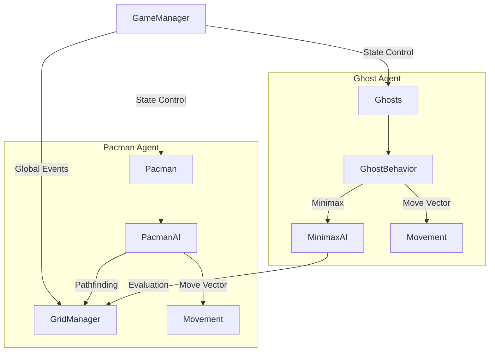
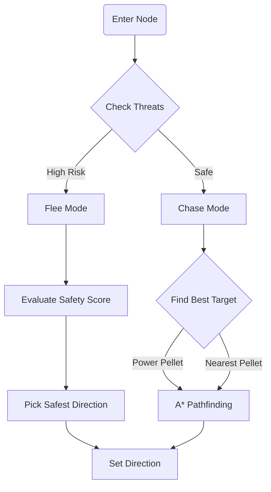
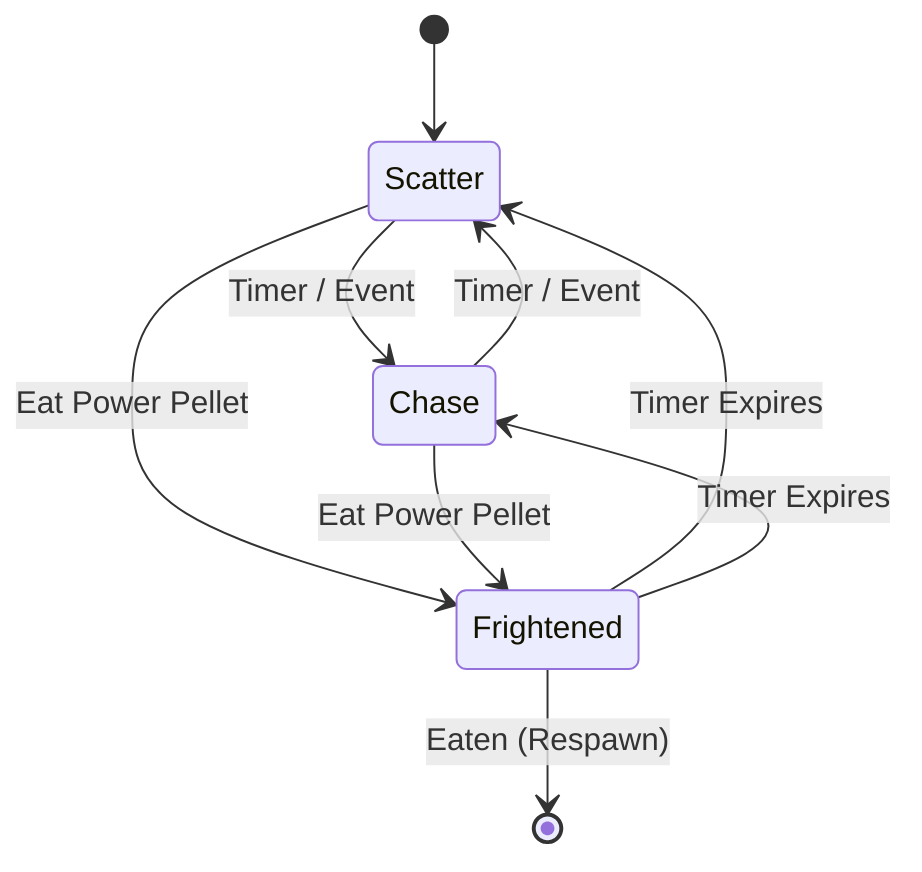

<<<<<<< HEAD
# AI-Powered Pac-Man: Game Rules and AI Algorithm Design

## Table of Contents

1. [Game Rules](#game-rules)
2. [System Architecture](#system-architecture)
3. [Pac-Man AI Design](#pac-man-ai-design)
4. [Ghost AI Design](#ghost-ai-design)
5. [Pathfinding Algorithms](#pathfinding-algorithms)
6. [Coordination and Multi-Agent Behavior](#coordination-and-multi-agent-behavior)

---

## Game Rules

### Core Mechanics

- **Objective**: Pac-Man must collect all pellets in the maze while avoiding ghosts.
- **Lives**: Pac-Man starts with 3 lives. Losing all lives results in game over.
- **Scoring**:
  - Regular pellets: 10 points each
  - Power pellets: 50 points each
  - Ghosts (when vulnerable): 200, 400, 800, 1600 points (increasing multiplier)
- **Power Pellets**: When consumed, ghosts enter a "Frightened" state for a limited duration (approximately 6-8 seconds), during which they can be eaten by Pac-Man.
- **Movement**: All agents move on a discrete grid system. Movement is tile-based, not continuous.
- **Win Condition**: Collect all pellets in the maze.
- **Loss Condition**: Pac-Man is caught by a non-frightened ghost, and no lives remain.

### Game States

1. **Normal State**: Ghosts pursue Pac-Man using their AI strategies.
2. **Frightened State**: Triggered when Pac-Man consumes a power pellet. Ghosts flee from Pac-Man and can be eaten.
3. **Scatter State**: (Optional classic behavior) Ghosts retreat to their corners periodically.
4. **Chase State**: Ghosts actively pursue Pac-Man using their AI algorithms.

---

## System Architecture

### Component Overview

```
GameManager
├── Game State Management
├── Score & Lives Tracking
└── Event Coordination

GridManager
├── Node Graph Generation
├── Pathfinding Interface (IPathfinder)
└── Visual Debugging

Pac-Man Agent
├── State Machine (ChasingPellets, Fleeing, Recovering)
├── Pathfinding (A*)
├── Threat Detection
└── Decision Layer

Ghost Agents (3 instances)
├── Individual AI Controllers
├── Pathfinding (A*)
├── Minimax Decision Making
└── Behavior States (Chasing, Scattering, Frightened)
```

### Data Structures

- **Node Graph**: Represents the maze as a graph where each walkable tile is a node with connections to adjacent walkable nodes.
- **Game State**: Captures positions of all agents, remaining pellets, active power-ups, and current game phase.
- **Path**: Ordered list of nodes representing a route from start to goal.

---

## Pac-Man AI Design

### Overview

Pac-Man operates as an autonomous agent with goal-oriented behavior. The AI balances two primary objectives:

1. **Maximize Score**: Collect pellets efficiently
2. **Minimize Risk**: Avoid ghosts and survive

### Algorithm: Goal-Based Decision Making with A\* Pathfinding

#### State Machine

Pac-Man uses a finite state machine with three primary states:

1. **ChasingPellets State**

   - **Goal**: Collect pellets while maintaining safe distance from ghosts
   - **Behavior**:
     - Identifies nearest pellet using A\* pathfinding
     - Evaluates threat level (distance to nearest ghost)
     - If threat is low (ghost distance > threshold), pursues pellet
     - If threat is high, transitions to Fleeing state

2. **Fleeing State**

   - **Goal**: Escape from nearby ghosts
   - **Behavior**:
     - Calculates escape routes using A\* to find safe zones
     - Prioritizes paths that maximize distance from all ghosts
     - Uses threat map to identify least dangerous directions
     - Transitions back to ChasingPellets when safe

3. **Recovering State** (Optional)
   - **Goal**: Regain composure after near-miss
   - **Behavior**: Brief pause or cautious movement before resuming normal behavior

#### Decision Logic Pseudocode

```
function DecideAction():
    nearestPellet = FindNearestPellet()
    nearestGhost = FindNearestGhost()
    threatLevel = CalculateThreatLevel(nearestGhost)

    if threatLevel > DANGER_THRESHOLD:
        return FleeToSafeZone()
    else if PowerPelletAvailable() and CanReachSafely():
        return PathToPowerPellet()
    else:
        return PathToPellet(nearestPellet)
```

#### Pathfinding Implementation

- **Algorithm**: A\* (A-Star) with Manhattan distance heuristic
- **Heuristic Function**: `h(n) = |x_goal - x_current| + |y_goal - y_current|`
- **Cost Function**: Each step has uniform cost (1 unit per tile)
- **Why A\***: More efficient than Dijkstra for single-target pathfinding, guaranteed optimal paths with admissible heuristic

#### Threat Detection

- **Method**: Calculates distance to all ghosts using A\* pathfinding
- **Threat Score**: `threat = Σ(1 / (distance_to_ghost[i] + 1))` for all ghosts
- **Threshold**: If threat score > 0.5 or any ghost within 3 tiles, enter Fleeing state

#### Power Pellet Strategy

- When power pellet is available and reachable:
  - Prioritize path to power pellet if it's within safe distance
  - After consuming, aggressively pursue nearest ghost for bonus points
  - Track remaining frightened time to maximize ghost captures

---

## Ghost AI Design

### Overview

Each ghost operates as an adversarial agent with the primary goal of capturing Pac-Man. The ghosts use Minimax algorithm with alpha-beta pruning to anticipate Pac-Man's moves and plan optimal pursuit strategies.

### Key Design Decision: Individual vs. Shared Minimax

**Answer: Each ghost uses the SAME Minimax algorithm framework, but with DIFFERENT evaluation functions and strategic roles.**

#### Rationale

1. **Computational Efficiency**: Running Minimax for each ghost independently would be computationally expensive. Instead, we use a shared Minimax evaluation but with role-specific heuristics.
2. **Strategic Diversity**: Each ghost has a unique "personality" or role that influences its decision-making:
   - **Ghost 1 (Aggressive)**: Prioritizes direct pursuit, minimizes distance to Pac-Man
   - **Ghost 2 (Intercept)**: Predicts Pac-Man's future position and moves to intercept
   - **Ghost 3 (Defensive)**: Positions to cut off escape routes and block Pac-Man's path

### Minimax Algorithm Implementation

#### Algorithm Structure

```
function Minimax(state, depth, isMaximizing, alpha, beta):
    if depth == 0 or GameOver(state):
        return EvaluateState(state)

    if isMaximizing:  // Ghost's turn
        maxEval = -∞
        for each possible ghost move:
            eval = Minimax(Result(state, move), depth-1, false, alpha, beta)
            maxEval = max(maxEval, eval)
            alpha = max(alpha, eval)
            if beta <= alpha:
                break  // Alpha-beta pruning
        return maxEval
    else:  // Pac-Man's turn (minimizing)
        minEval = +∞
        for each possible pacman move:
            eval = Minimax(Result(state, move), depth-1, true, alpha, beta)
            minEval = min(minEval, eval)
            beta = min(beta, eval)
            if beta <= alpha:
                break  // Alpha-beta pruning
        return minEval
```

#### Depth Limitation

- **Search Depth**: 2-3 moves ahead (to maintain real-time performance)
- **Reason**: Full Minimax would be computationally prohibitive. Depth-limited Minimax with good heuristics provides strong play.

#### State Representation

```
GameState {
    pacmanPosition: Vector2Int
    ghostPositions: Vector2Int[]
    remainingPellets: List<Vector2Int>
    powerPelletActive: bool
    frightenedTimeRemaining: float
    currentScore: int
}
```

#### Evaluation Function (Ghost-Specific)

**Ghost 1 - Aggressive Pursuer:**

```
eval = -distanceToPacman + (100 if canCapture) - (50 if nearPowerPellet)
```

**Ghost 2 - Interceptor:**

```
predictedPacmanPos = PredictPacmanPosition(2 steps ahead)
eval = -distanceToPredictedPos + (80 if blockingPath) - (30 if isolated)
```

**Ghost 3 - Defensive Blocker:**

```
eval = -distanceToPacman + (120 if cuttingOffEscapeRoute) - (40 if tooFarFromOthers)
```

### Behavior States

Each ghost transitions between states based on game events:

1. **Chasing State**

   - Uses Minimax to determine optimal pursuit move
   - Applies ghost-specific evaluation function
   - Primary behavior

2. **Scattering State** (Optional Classic Behavior)

   - Ghosts retreat to designated corners
   - Occurs periodically (e.g., every 20 seconds for 7 seconds)
   - Uses simple pathfinding to corner position

3. **Frightened State**
   - Triggered when Pac-Man consumes power pellet
   - **Behavior Change**: Instead of Minimax, uses random or flee-from-Pac-Man logic
   - Minimax is disabled during this state for performance and gameplay reasons
   - Ghosts move away from Pac-Man using A\* pathfinding

### Coordination Strategy

While each ghost operates independently, they achieve coordination through:

1. **Shared Information**: All ghosts have access to the same game state
2. **Complementary Roles**: Different evaluation functions naturally create diverse behaviors
3. **Implicit Coordination**: Minimax's adversarial nature naturally leads to strategic positioning

**Note**: We do NOT implement explicit communication between ghosts. Coordination emerges from their individual decision-making processes.

---

## Pathfinding Algorithms

### A\* Algorithm (Primary)

**Used By**: Both Pac-Man and Ghosts

**Implementation**:

```
function AStar(start, goal):
    openSet = PriorityQueue()
    openSet.add(start, 0)
    cameFrom = Map()
    gScore = Map()  // Cost from start
    gScore[start] = 0
    fScore = Map()  // Estimated total cost
    fScore[start] = heuristic(start, goal)

    while openSet is not empty:
        current = openSet.pop()  // Node with lowest fScore

        if current == goal:
            return ReconstructPath(cameFrom, current)

        for each neighbor of current:
            tentative_gScore = gScore[current] + 1  // Edge cost = 1

            if tentative_gScore < gScore[neighbor]:
                cameFrom[neighbor] = current
                gScore[neighbor] = tentative_gScore
                fScore[neighbor] = gScore[neighbor] + heuristic(neighbor, goal)

                if neighbor not in openSet:
                    openSet.add(neighbor, fScore[neighbor])

    return null  // No path found
```

**Heuristic**: Manhattan Distance

- Admissible (never overestimates)
- Efficient for grid-based movement
- Formula: `h(n) = |x_goal - x_n| + |y_goal - y_n|`

### Dijkstra Algorithm (Baseline/Comparison)

**Purpose**: Used for comparison and as a fallback when heuristics are not applicable.

**Implementation**: Similar to A\*, but without heuristic (fScore = gScore).

**When Used**:

- Initial pathfinding tests
- When comparing algorithm performance
- As a baseline for evaluation

---

## Coordination and Multi-Agent Behavior

### How Ghosts Coordinate Without Explicit Communication

1. **Shared Game State**: All ghosts observe the same game state, allowing implicit coordination.

2. **Role-Based Behavior**:

   - Each ghost's unique evaluation function creates natural role specialization
   - Aggressive ghost closes distance
   - Interceptor predicts and cuts off
   - Blocker positions defensively

3. **Emergent Coordination**:
   - Minimax's adversarial nature naturally leads to strategic positioning
   - Ghosts don't need to communicate; their individual optimal strategies create effective group behavior

### Pac-Man vs. Ghosts Interaction

- **Pac-Man's Perspective**: Treats all ghosts as threats, uses threat aggregation
- **Ghosts' Perspective**: Each ghost independently tries to capture Pac-Man
- **Asymmetric Goals**: Creates natural adversarial dynamics

---

## Performance Considerations

### Optimization Strategies

1. **Minimax Depth Limiting**: Limited to 2-3 moves to maintain 60 FPS
2. **Alpha-Beta Pruning**: Reduces explored nodes by ~50-70%
3. **Pathfinding Caching**: Cache frequently used paths
4. **State Evaluation Caching**: Memoize evaluation function results
5. **Asynchronous Processing**: Run Minimax calculations in background threads when possible

### Expected Performance Metrics

- **Pathfinding**: < 1ms per path (A\* on typical maze)
- **Minimax (per ghost)**: 5-15ms per decision (depth 2-3)
- **Total AI Overhead**: < 50ms per frame (target: < 16ms for 60 FPS)

---

## Summary

### Key Design Decisions

1. **Pac-Man AI**: Goal-based state machine with A\* pathfinding and threat-aware decision making
2. **Ghost AI**: Minimax with alpha-beta pruning, shared algorithm but unique evaluation functions per ghost
3. **Pathfinding**: A\* as primary algorithm, Dijkstra for comparison
4. **Coordination**: Implicit through role-based behavior, no explicit communication

### Algorithm Distribution

| Agent   | Primary Algorithm | Secondary Algorithm   | Purpose                      |
| ------- | ----------------- | --------------------- | ---------------------------- |
| Pac-Man | A\* Pathfinding   | State Machine         | Navigation & Decision Making |
| Ghost 1 | Minimax + A\*     | Aggressive Evaluation | Direct Pursuit               |
| Ghost 2 | Minimax + A\*     | Intercept Evaluation  | Predictive Positioning       |
| Ghost 3 | Minimax + A\*     | Defensive Evaluation  | Route Blocking               |

This design provides a balance between computational efficiency and intelligent behavior, demonstrating both pathfinding and adversarial AI concepts in a cohesive game system.
=======
# AI-Powered Pac-Man: Game Rules and AI Algorithm Design

## Table of Contents
1. [Game Rules](#game-rules)
2. [System Architecture](#system-architecture)
3. [Pac-Man AI Design](#pac-man-ai-design)
4. [Ghost AI Design](#ghost-ai-design)
5. [Pathfinding Algorithms](#pathfinding-algorithms)
6. [Coordination and Multi-Agent Behavior](#coordination-and-multi-agent-behavior)

---

## Game Rules

The objective of Pac-Man is to accumulate points by eating pellets while avoiding four ghosts.

### Scoring

| Item | Points | Effect |
| :--- | :---: | :--- |
| **Pellet (Dot)** | 10 | Standard point item. |
| **Power Pellet** | 50 | Turns ghosts **blue** (Frightened). |
| **Ghost (1st)** | 200 | Score doubles for each subsequent ghost. |
| **Ghost (2nd)** | 400 | |
| **Ghost (3rd)** | 800 | |
| **Ghost (4th)** | 1600 | Maximum combo score. |

### Mechanics
*   **Lives**: Pac-Man starts with 3 lives.
*   **Game Over**: When all lives are lost.
*   **Level Complete**: When all pellets are eaten.
*   **Frightened Mode**: Eating a Power Pellet turns ghosts blue for a short duration. They move slower and can be eaten.
*   **Collision**: Touching a non-frightened ghost causes death and resets the level positions.

---

## System Architecture

The project is built on Unity (2022.3+) using a component-based architecture optimized for AI decision-making.



### Core Components
*   **`GameManager`**: The "God Object" that manages game state (Score, Lives, Level Reset), pellet collection, and global events (Power Pellet activation).
*   **`GridManager`**: Generates and maintains the navigation graph. It scans the level for `Node` objects and connects them based on valid movement directions (Raycasting hallways).
*   **`Node`**: Represents an intersection or decision point in the maze. AI agents only make decisions when entering a Node Trigger.
*   **`PerformanceMetrics`**: (Optional) Tracks AI efficiency (nodes explored, decision time) for analysis.

### data Flow
1.  **Input**: Environment state (Ghost positions, Pellet positions, Map Graph).
2.  **Processing**: AI Agents (`PacmanAI`, `GhostChase`) calculate optimal moves using pathfinding.
3.  **Output**: `Movement` component receives a direction vector and moves the Rigidbody2D.

---

## Pac-Man AI Design

Pac-Man uses a **Heuristic Utility AI** that balances two conflicting goals: **Survival** (Flee) and **Greed** (Chase).

### Decision Flowchart



### 1. Threat Evaluation
Every decision frame (at a node), Pac-Man scans for ghosts within a `dangerRadius` (default: 5 units).
*   **Heuristic**: `ThreatScore = Sum(1 / (Distance + 1))` for all active ghosts.
*   If `ThreatScore > Threshold`, Pac-Man enters **Flee Mode**.

### 2. Decision Logic
*   **Flee Mode**:
    *   Evaluates all valid directions at the current node.
    *   Simulates moving 1 step in each direction.
    *   Calculates a **Safety Score** for that future position.
    *   **Selection**: Picks the direction with the highest Safety Score. Directions leading to dead-ends or closer to ghosts are penalized heavily.
*   **Chase Mode**:
    *   Identifies the "Best Pellet" target.
        *   Priority 1: Active Power Pellets (Bonus Score).
        *   Priority 2: Nearest Pellet (Distance Score).
    *   **Selection**: Uses pathfinding (A* or Dijkstra) to find the first step toward that target.

### 3. Stuck Recovery
A failsafe mechanism runs in the background. If Pac-Man's position remains unchanged for 0.5 seconds (stuck on a wall or physics edge case), the AI:
1.  Force-snaps its position to the exact center of the nearest Node.
2.  Picks a random valid direction to "unstuck" itself.

---

## Ghost AI Design

The Ghosts (Blinky, Pinky, Inky, Clyde) operate using a **Finite State Machine (FSM)** with three states:

### State Machine



### 1. Scatter (Patrol)
*   **Goal**: Disperse to corners of the map.
*   **Algorithm**: **Random Non-Reverse**.
    *   At each intersection, picks a random available direction.
    *   **Constraint**: Cannot reverse direction (180° turn) unless it's a dead-end. This creates a natural "patrolling" movement that covers ground without getting stuck in loops.

### 2. Chase (Attack)
*   **Goal**: Capture Pac-Man.
*   **Algorithm**: **Minimax**.
    *   The Ghost uses a game-theoretic approach to predict current game state.
    *   **Depth**: Looks ahead 3 moves.
    *   **Evaluation**: It assumes Pac-Man will try to maximize his distance from the ghost (Optimal Play). The Ghost picks the move that minimizes this distance.
    *   This makes the ghosts feel "smart" and predictive rather than just following a path.

### 3. Frightened (Run Away)
*   **Goal**: Survive.
*   **Algorithm**: **Random**.
    *   Moves slower.
    *   Picks random turns.
    *   Rendered blue to indicate vulnerability.

---

## Pathfinding Algorithms

The project implements two classic graph search algorithms for navigation.

| Algorithm | Type | Implementation | Best Use Case | pros | Cons |
| :--- | :--- | :--- | :--- | :--- | :--- |
| **A* (A-Star)** | Heuristic | `PacmanAI` (Chase) | Large maps, specific targets | **Fast**, optimal path | heuristic dependent |
| **Dijkstra** | Uninformed | `PacmanAI` (Option) | Analysis, unknown terrain | **Guaranteed Shortest** | Slow (Uniform flood fill) |
| **Minimax** | Game Theory | `GhostChase` | Adversarial play | **Predictive**, "Smart" | Computationally expensive |
| **Random** | Stochastic | `GhostScatter` | Unpredictability | Low CPU usage | Inefficient navigation |

### A* (A-Star)
*   **Type**: Heuristic Search (Informed).
*   **Heuristic Used**: Manhattan Distance (`|dx| + |dy|`).
*   **Behavior**: Prioritizes nodes that are physically closer to the target.
*   **Performance**: Fast (Visits fewer nodes). Optimal for this grid-based game.
*   **Usage**: Default algorithm for Pac-Man's pellet chasing.

### Dijkstra
*   **Type**: Uniform Cost Search (Uninformed).
*   **Behavior**: Explores outward in "concentric circles" from the start node. Guaranteed to find the shortest path but explores many unnecessary nodes in other directions.
*   **Performance**: Slower than A*.
*   **Usage**: Selectable option for comparison or when heuristics might fail (complex mazes).

**Configuration**: You can toggle between these two in the `PacmanAI` component in the Unity Inspector.

---

## Coordination and Multi-Agent Behavior

While each agent (Ghost) calculates its own moves, consistent global rules create emergent complexity.

### 1. Global State Management
The `GameManager` acts as the conductor. When a Power Pellet is eaten, it triggers a global state change:
*   All Ghosts respond immediately via the `GhostFrightened` behavior.
*   Their speed is reduced globally.
*   Their collisions are disabled (they become edible).

### 2. Spatial Coordination (Indirect)
*   **Ghost Home**: Ghosts start in a "Home" box and exit one by one. This staggers their entry into the maze, preventing an impossible "swarm" at the start.
*   **Scatter Mode**: Using the "Non-Reverse" constraint prevents ghosts from clustering in small areas. They naturally spread out when not chasing.

### 3. Pac-Man vs. Multi-Agent Swarm
Pac-Man's AI is designed to handle multiple threats:
*   The `ThreatScore` is cumulative. If 3 ghosts are approaching from different angles, the "Danger" value spikes much higher than for a single ghost.
*   The **Safety Scoring** algorithm implicitly finds the "gap" in the swarm. If Blinky is North and Pinky is East, the safety score for South/West will be highest, naturally guiding Pac-Man through the open escape route.
>>>>>>> ac9c243 (Initial commit)
